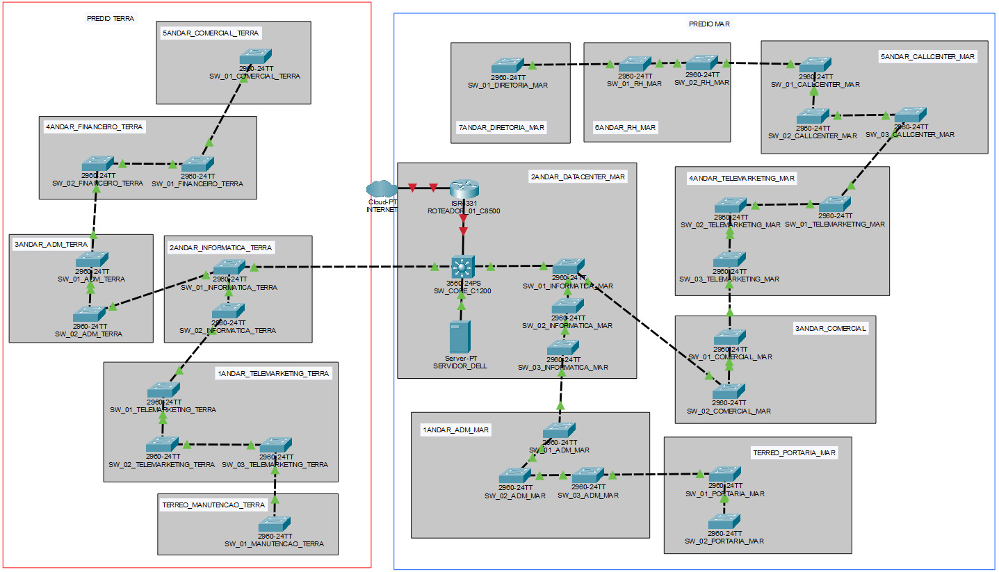

# Projeto Integrador: Modernização de Infraestrutura de Rede e Segurança Cibernética

**Instituição:** Centro Universitário Senac  
**Curso:** Segurança Cibernética  
**Projeto:** Práticas Extensionistas - Estudo de Caso XYZ Indústria e Comércio LTDA  

---

## Visão Geral do Projeto
Este repositório apresenta o diagnóstico técnico e a proposta de reestruturação da infraestrutura de rede da empresa XYZ LTDA. O foco principal reside na transição de uma rede legada e vulnerável para um ambiente de alta disponibilidade e performance, aplicando protocolos de segurança e segmentação lógica.

### Diagnóstico da Infraestrutura Legada
A análise inicial identificou gargalos críticos que comprometiam a integridade e a disponibilidade dos dados:
* **Performance:** Uso de hubs e rede operando em half-duplex, resultando em altos índices de colisão e latência.
* **Segurança:** Ausência de segmentação de rede (VLANs), permitindo que o tráfego de departamentos sensíveis fosse visível em todo o domínio de broadcast.
* **Resiliência:** Topologia em barramento baseada em cabos coaxiais, onde uma falha física pontual interrompia a operação de edifícios inteiros.

## Arquitetura Proposta
A nova infraestrutura utiliza uma topologia estrela estendida, projetada para suportar a interconexão dos prédios Terra e Mar com foco em redundância e controle perimetral.

### Especificações Técnicas
* **Core e Distribuição:** Implementação de Switch Cisco Catalyst 3560-24PS e Roteador Cisco ISR 4331.
* **Camada de Acesso:** Switches Cisco Catalyst 2960 distribuídos para atendimento aos 13 andares da organização.
* **Meio Físico:** Enlace de Fibra Óptica Multimodo entre edifícios e cabeamento horizontal Cat6 (1 Gbps).
* **Camadas de Segurança:** * Implementação de VLANs para isolamento de tráfego entre departamentos.
    * Configuração de Firewall perimetral no gateway para filtragem de pacotes.
    * Proteção de Endpoints via Trend Micro Apex One.

## Topologia da Rede
A arquitetura foi validada através do software Cisco Packet Tracer. A simulação confirmou a viabilidade da comunicação entre os setores operacionais e o Data Center central, respeitando as políticas de acesso e segurança estabelecidas.

## Planejamento de Governança
O projeto contempla a viabilidade administrativa e financeira para a execução da obra:
* **Cronograma Executivo:** Plano de execução técnica estruturado em 44 dias úteis.
* **Análise Orçamentária:** Investimento total de R$ 2.164.363,45, abrangendo ativos de rede, cabeamento, licenças e serviços de instalação.
* **Gestão de Recursos:** Definição de organograma de TI e atribuições técnicas para suporte ao ambiente modernizado.

---
*Trabalho acadêmico desenvolvido para a disciplina de Projeto Integrador do curso de Segurança Cibernética - Senac SP (2025).*
